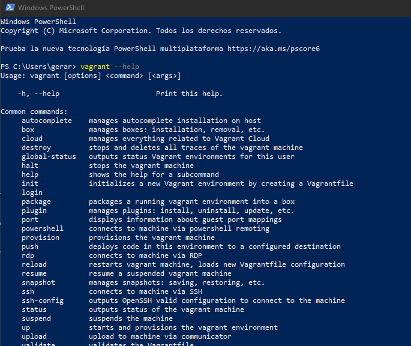
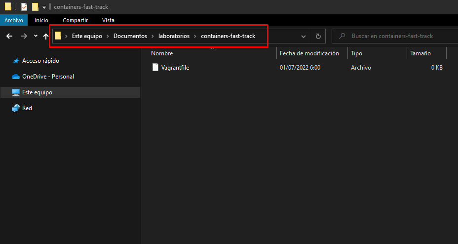
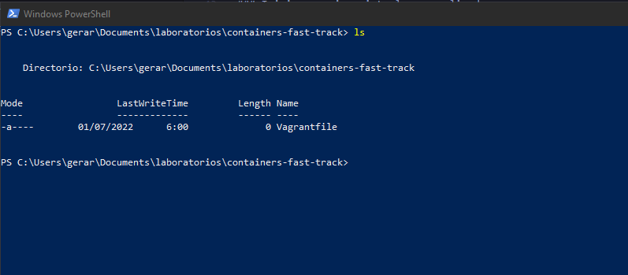

# Configuración Inicial 

En el siguiente apartado, encontrara todo lo necesario para la instalación y configuración de su laboratorio para realizar los ejercicios del curso

> ##### Resultado: Instalar VirtualBox y Vagrant e iniciar una máquina virtual personalizada utilizando el fichero _Vagrantfile_


Los siguientes puntos son necesario para instalar su entorno de laboratorio

- [ ] [Instalación de VirtualBox](#install-vb)
- [ ] [Instalación de Vagrant](#install-v)
- [ ] [Iniciar máquina virtual personalizada](#init)

> El siguiente manual está basado sobre el Sistema Operativo Windows 10 (x86_64)

<a name="install-vb"></a>
### Instalación de VirtualBox

VirtualBox es una aplicación que sirve para hacer máquinas virtuales con instalaciones de sistemas operativos. Permitir instalar otros sistemas operativos o el mismo que ya tienes dentro de tu ordenador. Lo utilizaremos para instalar un entorno de laboratorio aislado de nuestro sistema operativo principal.

1. Descargar e Instalar la última versión estable de **VirtualBox** para Windows [aqui](https://download.virtualbox.org/virtualbox/6.1.34/VirtualBox-6.1.34a-150636-Win.exe) 

>El programa iniciara el asistente de instalación. Dejar por defecto todas las configuraciones que recomienda en asistente.

<a name="install-v"></a>
### Instalación de Vagrant

Vagrant es una herramienta que nos permite crear cualquier entorno de desarrollo basado en máquinas virtuales. Ofrece una interfaz fácil de usar para crear servidores con configuraciones personalizadas mediante la definición de un fichero llamado _Vagrantfile_. Vagrant puede utilizar VirtualBox con el objetivo de simplificar la configuración de este software de virtualización

1. Descargar e Instalar la última versión estable de **Vagrant** para Windows [aqui](https://releases.hashicorp.com/vagrant/2.2.19/vagrant_2.2.19_x86_64.msi)

>El programa iniciara el asistente de instalación. Dejar por defecto todas las configuraciones que recomienda en asistente.

2. Una vez finalizado la instalación, inicie la interfaz de línea de comandos (CLI) _PowerShell_. Verifique si el _CLI PowerShell_ detecta correctamente el comando `vagrant`

```powershell
vagrant --help
```



<a name="init"></a>
### Iniciar máquina virtual personalizada

Vagrantfile se utiliza para describir el tipo de máquina requerida para un proyecto y cómo configurar y aprovisionar estas máquinas. Vagrant está diseñado para ejecutarse con un Vagrantfile por proyecto.

La siguiente definición de Vagrantfile, cuenta con todas las personalizaciones de nuestro laboratorio. Realice las siguientes acciones para configurar su proyecto de vagrant personalizado

1. Defina un directorio para crear sus proyectos de Vagrant. En este ejemplo utilizaremos la siguiente ruta `Documentos/laboratorios/containers-fast-track`

2. Dentro del directorio mencionado en el punto anterior, genere o copie el archivo `Vagrantfile` que se encuentra disponible en el [repositorio](Vagrantfile)



3. Inicie una terminal de línea de comandos PowerShell y vaya a la ubicacion del directorio que ha generado, donde se encuentra el fichero mencionado en el punto anterior



4. Inicialice su máquina virtual personalizada con los siguientes comandos:

```powershell
vagrant up
```

> El proceso iniciar la descarga y configuración de la maquina virtual personalizada para el curso

5. Ingresar dentro de la maquina virtual:


Una vez finalizado la instalación, podrá acceder a la maquina generada con el comando `vagrant ssh`. Recuerde que para interactuar con la VM generada, debe de estar dentro del directorio `Documentos/laboratorios/containers-fast-track`

```powershell
vagrant ssh
```

6. Realizar comandos de pruebas:


Valide su correcta configuración con los siguientes comandos

```bash
cat /etc/os-release
docker --version
docker-compose --version
```

7. Manejo básico de la máquina virtual

* Iniciar: `vagrant up`
* Verificar Estado: `vagrant status`
* Reiniciar: `vagrant reload`
* Apagar: `vagrant halt`
* Eliminar: `vagrant destroy`

