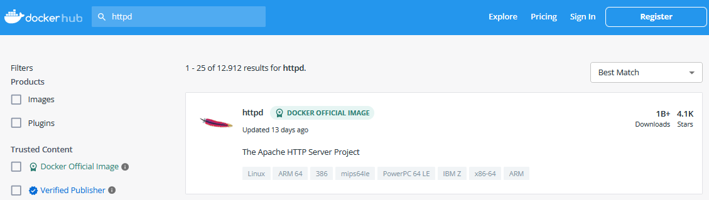

## Gestión de Imágenes: 01

1. Explore el catálogo de DockerHub. Ingrese al portal https://hub.docker.com/search?q=

2. Busque la imagen `httpd` en el catálogo. Ingrese a su página principal de la imagen



3. Descargue la imagen en su repositorio local
```
sudo docker pull httpd
```

4. Verifique la lista de imágenes en su repositorio local. Compruebe que la imagen `httpd` se encuentre disponible
```
sudo docker images
```

5. Busque la misma imagen desde el catálogo de dockerhub utilizando la linea de comandos
```
sudo docker search httpd --limit=10 
```
> --limit=10 Limita el resultado a 10 salidas

Retornara una lista parecida a la siguiente:
```yaml
NAME                             DESCRIPTION                                     STARS     OFFICIAL   AUTOMATED
httpd                            The Apache HTTP Server Project                  4070      [OK]
centos/httpd-24-centos7          Platform for running Apache httpd 2.4 or bui…   44
clearlinux/httpd                 httpd HyperText Transfer Protocol (HTTP) ser…   1
manageiq/httpd                   Container with httpd, built on CentOS for Ma…   1                    [OK]     
centos/httpd-24-centos8                                                          1
dockerpinata/httpd                                                               1
publici/httpd                    httpd:latest                                    1                    [OK]     
19022021/httpd-connection_test   This httpd image will test the connectivity …   0
paketobuildpacks/httpd                                                           0
manasip/httpd                                                                    0
```

6. Descargue la imagen `httpd` con el tag `2.4` en su repositorio local
```
sudo docker pull httpd:2.4
```

7. Verifique la lista de imágenes en su repositorio local. Compruebe que la imagen `httpd` se encuentre disponible. También debe mostrar el tag `2.4`
```
sudo docker images
```

8. Inicie un contenedor con la imagen 'httpd' utilizando el tag `2.4`. El nombre del contenedor debe ser `myweb01`.
```
sudo docker run --name myweb01 -d httpd:2.4
```

9. Elimine la imagen con el tag `latest`
```
sudo docker image rm httpd:latest
```

10. Verifique la lista de imágenes en su repositorio local. Compruebe que la imagen `httpd` se encuentre disponible. Solamente debe mostrar el tag `2.4`. 
```
sudo docker images
```
