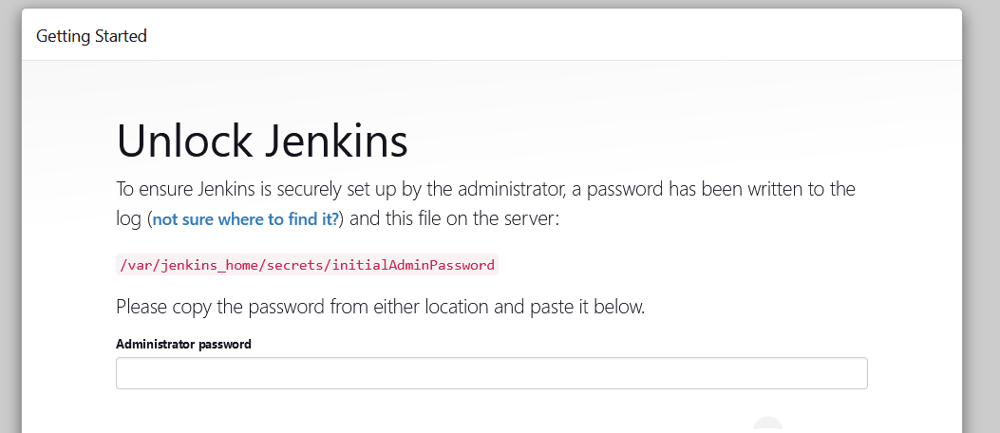

## Redes en Contenedores: 02

1. Inicie un nuevo contenedor con la imagen `jenkins/jenkins:jdk11`. El nombre del contenedor debe ser `jenkins-server-01`. Habilite el tráfico al `puerto 8080` del contenedor utilizando el `puerto 8082` del servidor
> En este paso, iniciaremos un nuevo contenedor JENKINS y asignaremos el puerto 8082 en el host de Docker al puerto 8080 dentro del contenedor. Esto significa que el tráfico que llega al host de Docker en el puerto 8082 pasará al puerto 8080 dentro del contenedor
```
sudo docker run --name jenkins-server-01 -p 8082:8080 -d jenkins/jenkins:jdk11
```

2. Verifique la ejecución de su contenedor
```
sudo docker ps
``` 

3. Identifique la IP de su máquina virtual (servidor Docker)
```
ip addr show eth1
```

4. Ingrese a su navegador. Utilice la IP de su máquina virtual y el puerto que indicamos en los pasos anteriores `8082`

```
http://IP-MAQUINA-VIRTUAL:8082
```

5. Debe observar la pagina de inicio Jenkins

