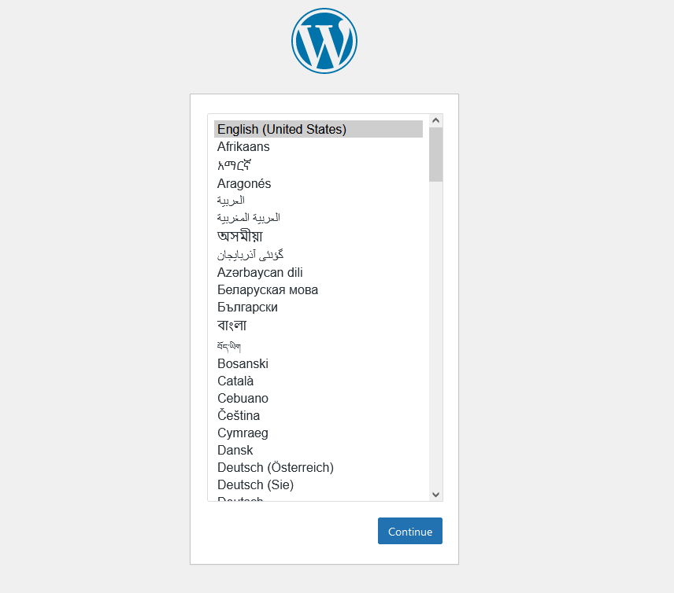

## Operaciones con Contenedores: 01

En el siguiente laboratorio vamos a crear una aplicación en Wordpress. Utilizando dos contenedores enlazados entre sí.
Un servicio WEB (wordpress) y servicio de Base de Datos (MySQL)
* Contenedor de WordPress
* Contenedor de Mysql

1. Crear un directorio de trabajo para la creación de contenedores con Docker Compose
```
mkdir wordpress-app
```

2. Dentro del directorio, crear el fichero `docker-compose.yml`
```
vi docker-compose.yml
```

3. Ingresamos la siguiente configuración dentro del fichero `docker-compose.yml`
```yaml
version: "3.9"
    
services:
  db:
    image: mysql:5.7
    volumes:
      - db_data:/var/lib/mysql
    restart: always
    environment:
      MYSQL_ROOT_PASSWORD: somewordpress
      MYSQL_DATABASE: wordpress
      MYSQL_USER: wordpress
      MYSQL_PASSWORD: wordpress
    
  wordpress:
    depends_on:
      - db
    image: wordpress:latest
    volumes:
      - wordpress_data:/var/www/html
    ports:
      - "8000:80"
    restart: always
    environment:
      WORDPRESS_DB_HOST: db
      WORDPRESS_DB_USER: wordpress
      WORDPRESS_DB_PASSWORD: wordpress
      WORDPRESS_DB_NAME: wordpress
volumes:
  db_data: {}
  wordpress_data: {}
```

4. Dentro del directorio de trabajo vamos a iniciar la instalación de la aplicación con el comando `docker-compose`
```
sudo docker-compose up -d
```

> Retornara el proceso de instalación y creación de los contenedores listados

5. Verifique la lista de aplicaciones iniciadas
```
sudo docker-compose ls
sudo docker-compose ps
```

6. En su navegador, ingrese la IP de su maquina virtual seguido del `puerto 8080`
```
http://IP-MAQUINA-VIRTUAL:8000
```

> Podrá observar la página de inicio de la aplicación wordpress


7. Detener la aplicación
```
sudo docker-compose stop
```

8. Verifique la lista de aplicaciones iniciadas
```
sudo docker-compose ls
sudo docker-compose ps
```